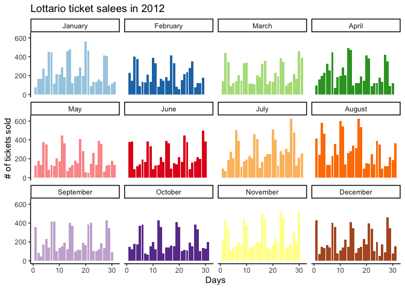
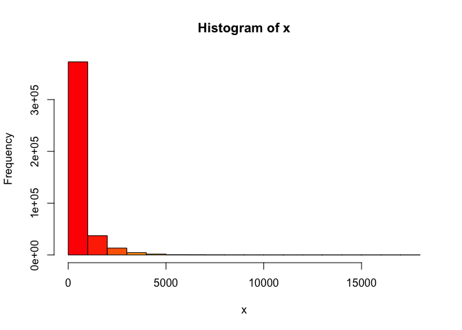
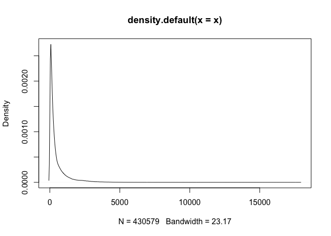

<!-- README.md is generated from README.Rmd. Please edit that file -->

# lottodata

<!-- badges: start -->


<!-- badges: end -->

`lottodata` is an R data package designed to house data sets that can be
easily accessible for me and everyone else working on the project. Check
out this [shiny app](https://andrewcli.shinyapps.io/Jackpot/) that uses
the `jackpot_size` data set from this package.

## Installation

You can install `lottodata` via
[GitHub](https://github.com/andr3wli/lottodata):

``` r
devtools::install_github("andr3wli/lottodata")
```

## Data

The package currently contains the following data sets:

| Date set name        | Source                                         | About                        | Description                                                    | Size   |
|----------------------|------------------------------------------------|------------------------------|----------------------------------------------------------------|--------|
| `jackpot_size`       | [Open Source Framework](https://osf.io/qwrxy/) | 430,579 rows &<br>10 columns | Jackpot size ($) and lotto ticket sales                        | 1.3 MB |
| `lotto_demographics` | [Open Source Framework](https://osf.io/utxjf/) | 96 rows &<br>7 coloumns      | Demographic information about residents in <br>Ontario, Canada | 5.4 MB |

### `jackpot_size`

The variables included in the data set:

| Variable       | Description                                                        | Type of variable |
|----------------|--------------------------------------------------------------------|------------------|
| `zip_code`     | The first 3 digits of postal code (geographical region)            | string           |
| `start_date`   | The start of the sales date (year-month-day format)                | date             |
| `end_date`     | The end of the sales date (year-month-day format)                  | date             |
| `game`         | The specific lottery game (one of: Lotto Max, Lotto 649, Lottario) | string           |
| `ticket_sales` | Number of tickets sold                                             | integer          |
| `net_sales`    | The total cad dollar amount of sales                               | integer          |
| `jackpot_size` | The jackpot size in cad dollars                                    | integer          |
| `year`         | Year                                                               | integer          |
| `month`        | Month                                                              | integer          |
| `day`          | Day                                                                | integer          |

## `lotto demographics`

The variables included in the data set:

| Variable      | Description                                                                                                                                                                                                                                                                                                                                                                                                            | Type of variable |
|---------------|------------------------------------------------------------------------------------------------------------------------------------------------------------------------------------------------------------------------------------------------------------------------------------------------------------------------------------------------------------------------------------------------------------------------|------------------|
| `zip_code`    | The first 3 digits of postal code (geographical region)                                                                                                                                                                                                                                                                                                                                                                | string           |
| `geo_id`      | Geography ID                                                                                                                                                                                                                                                                                                                                                                                                           | integer          |
| `income`      | Per capita income levels                                                                                                                                                                                                                                                                                                                                                                                               | integer          |
| `education`   | Highest completed level of education for the population                                                                                                                                                                                                                                                                                                                                                                | float            |
| `mbsa`        | Proportion of time spent in white collar employment. White collar <br>employment is defined as the proportion of residents aged 15 or <br>greater employed in management, business finance and administration, <br>health, education, law, social community and government services, <br>art, culture, natural and applied sciences and related occupations, <br>according to the National Occupational Classification | float            |
| `ses`         | SES was calculated via takling the sum of the Z-scores of it’s <br>per-capita income, years of education, and proportion of white-collar <br>workers                                                                                                                                                                                                                                                                   | float            |
| `description` | Describes where the location is in natural language                                                                                                                                                                                                                                                                                                                                                                    | string           |

## Example

Suppose you want to look at the game Lottario more in 2014:

``` r
library(lottodata)
library(dplyr)
#> 
#> Attaching package: 'dplyr'
#> The following objects are masked from 'package:stats':
#> 
#>     filter, lag
#> The following objects are masked from 'package:base':
#> 
#>     intersect, setdiff, setequal, union

# What is the yearly spending for the Lottario in zone M1B in 2012?
jackpot_size %>%
  filter(year == 2012 & game == "Lottario" & zip_code == "M1B") %>%
  head()
#> # A tibble: 6 x 10
#>   zip_code start_date end_date   game  ticket_sales net_sales jackpot_size  year
#>   <chr>    <date>     <date>     <chr>        <dbl>     <dbl>        <dbl> <dbl>
#> 1 M1B      2012-01-01 2012-01-07 Lott…           75       233       730000  2012
#> 2 M1B      2012-01-02 2012-01-07 Lott…          167       516       730000  2012
#> 3 M1B      2012-01-03 2012-01-07 Lott…          168       466       730000  2012
#> 4 M1B      2012-01-04 2012-01-07 Lott…          274       841       730000  2012
#> 5 M1B      2012-01-05 2012-01-07 Lott…          195       558       730000  2012
#> 6 M1B      2012-01-06 2012-01-07 Lott…          451      1469       730000  2012
#> # … with 2 more variables: month <dbl>, day <int>
```

## ggplot2 example

``` r
library(ggplot2)
theme_set(theme_classic())

jackpot_data <- jackpot_size
jackpot_plot <- jackpot_data %>%
  filter(year == 2012 & game == "Lottario" & zip_code == "M1B") %>%
  ggplot(aes(day, ticket_sales, fill = as.factor(month))) +
  geom_col() +
  facet_wrap(~month, labeller = labeller(month = 
                                           c("1" = "January", "2" = "February", "3" = "March", "4" = "April", "5" = "May",
                                             "6" = "June", "7" = "July", "8" = "August", "9" = "September", "10" = "October",
                                             "11" = "November", "12" = "December"))) +
  labs(x = "Days", y = "# of tickets sold", title = "Lottario ticket salees in 2012") +
  theme(legend.position = "none") +
  scale_fill_manual(values = c("#a6cee3","#1f78b4","#b2df8a","#33a02c","#fb9a99","#e31a1c",
                               "#fdbf6f","#ff7f00","#cab2d6","#6a3d9a","#ffff99","#b15928"))

jackpot_plot
```



## Example exploratory data analysis:

``` r
# EDA via base R

jackpot_eda <- function(x){
  hist(x, col = rainbow(30))
  plot(x)
  plot(density(x))
  data.frame(min = min(x),
             median = median(x),
             mean = mean(x),
             max = max(x),
             sd = sd(x),
             range =max(x) - min(x) )
}

jackpot_eda(jackpot_size$ticket_sales)
```



    #>   min median     mean   max       sd range
    #> 1   1    217 485.0569 17885 729.9844 17884

## Acknowledgement

We thank [Dr. Ross Otto](https://www.mcgill.ca/psychology/ross-otto)
from Mcgill University for sharing these data sets on Open Source
Framework. This project is being conducted with [Dr. Luke
Clark](https://psych.ubc.ca/profile/luke-clark/) at the [Centre for
Gambling Research at UBC](https://cgr.psych.ubc.ca).

## Code of Conduct

Please note that the lottodata project is released with a [Contributor
Code of
Conduct](https://contributor-covenant.org/version/2/0/CODE_OF_CONDUCT.html).
By contributing to this project, you agree to abide by its terms.
